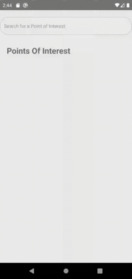

<h1 align="center">TomTom POIS API Usage Example 👋</h1>
<p>
  
  <a href="#" target="_blank">
    
  </a>


> This is a React-Native Typescript application that serves as an example on how to implement calls to the TomTom Points Of Interest Search API using Native Modules.</br>
> Using React Hooks and React Components we created a custom List View that inflates its children when a TomTom API response is received.</br>
> The Items inside The List View get populated from the Json response received from the API.</br>
> The networking requests are in native android (java) and are returned as a promise to React-Native (Typescript). </br>
> Native module implementation is completed only for the Android platform, iOS is not yet implemented. </br>
<p>

</p>

## Prerequisites 

- [Node.js > 12](https://nodejs.org) and npm
- [Watchman](https://facebook.github.io/watchman)
- [JDK > 8](http://openjdk.java.net/install/)
- [Android Studio and Android SDK](https://developer.android.com/studio) (This Project Targets Android SDK version 29 and Minimum SDK Version is 16. It is **only tested in Android 10(Q) SDK 29**)


## Dependencies & 3rd Party Libraries

| Name                                                     | Downloads                                                                                                                                                                                             |                                                                                     
| -------------------------------------------------------- | :---------------------------------------------------------------------------------------------------------------------------------------------------------------------------------------------------: | 
| [react-native-get-location](https://www.npmjs.com/package/react-native-get-location)             |  [](https://www.npmjs.com/package/react-native-get-location)             |
| [accordion-collapse-react-native](https://www.npmjs.com/package/accordion-collapse-react-native) |  [](https://www.npmjs.com/package/accordion-collapse-react-native) |

## Install
Download the project and install all the dependencies using:
```sh
git clone http://sdasd
cd TomTomPOIExample
npm install
```
### TomTom API Key
**Creating a TomTom Developer Account**
1. [Create a TomTom Developer Account](https://developer.tomtom.com/user/register)
2. Login and go to your [Dashboard](https://developer.tomtom.com/user/me/apps)
3. In the Keys Section, Generate and copy an API KEY

**Using your API Key in The Project:**
1. Go inside the android native files and open the TomTomPOIModule Class located in `android/app/src/main/java/com/tomtompoiexample/TomTomPOIModule.java`
2. Inside the class find the `static final String TOMTOM_API_KEY` and put your API key there

## Usage
First you need to start the Metro Javascript bundler. Inside the project root directory run:
```sh
react-native start
```

In order to run the app in a connected android device or emulator run:
```sh
react-native run-android 
```
## Disclaimer
In ordered to be easier to review this code contains A LOT of unneeded comments
But this also makes it better to serve as an example application.


## Author

👤 **John Kozaris**

* Github: [@johnkozaris](https://github.com/johnkozaris)
* LinkedIn: [@ioannis-kozaris](https://linkedin.com/in/ioannis-kozaris)

***
Give a ⭐️ if this project helped you!
